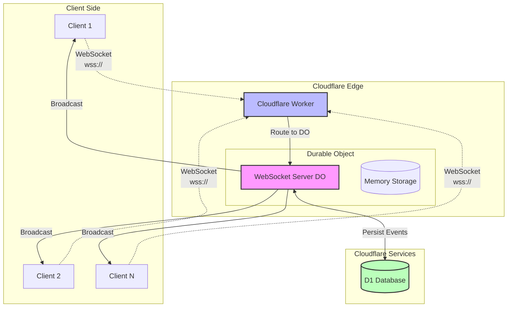
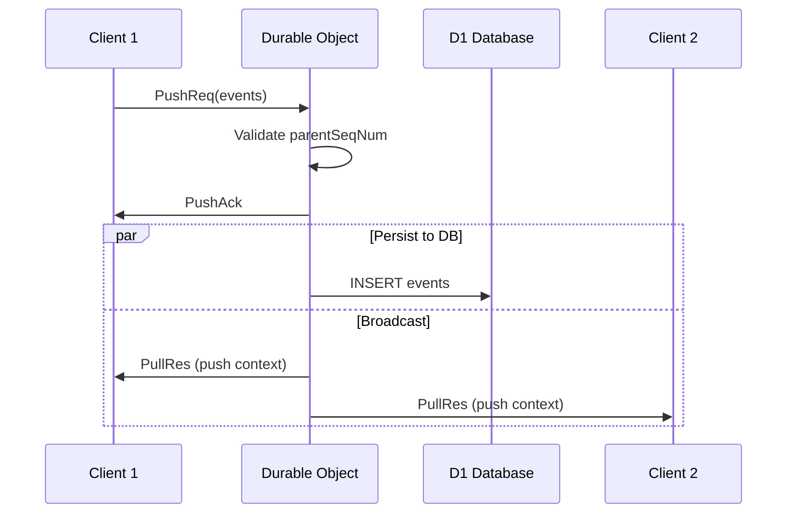
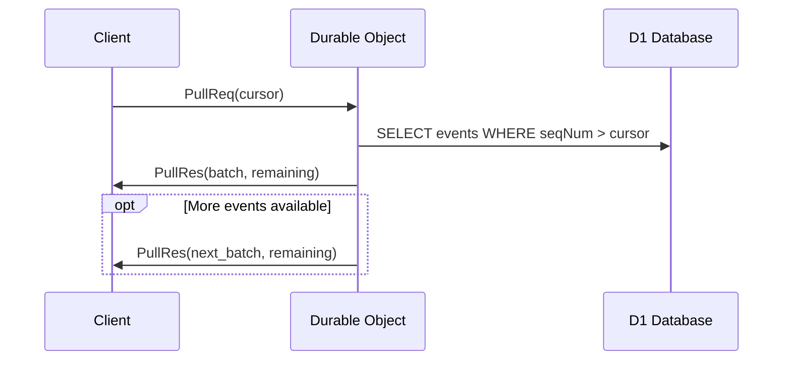

# @livestore/sync-cf Plugin - Technische Dokumentation

## Überblick

Das `@livestore/sync-cf` Plugin implementiert ein Echtzeit-Synchronisationssystem für LiveStore basierend auf Cloudflare Workers und Durable Objects. Es ermöglicht die bidirektionale Synchronisation von Events zwischen Clients über WebSocket-Verbindungen.

## Architektur-Übersicht

### Netzwerkdiagramm



## Komponenten-Architektur

### 1. Cloudflare Worker (cf-worker/)

**Hauptdateien:**
- `worker.ts` - HTTP Request Handler und WebSocket Upgrade Logic
- `durable-object.ts` - Durable Object Implementierung für WebSocket Management
- `cf-types.ts` - Cloudflare Worker Typen-Definitionen

#### Worker Implementierung (`worker.ts`)

Der Worker fungiert als Entry Point für alle HTTP-Requests:

**Funktionalitäten:**
- WebSocket Upgrade Handler für `/websocket` Endpoint
- Payload-Validierung beim Verbindungsaufbau
- CORS-Unterstützung (optional)
- Routing zu entsprechenden Durable Objects

**Wichtige Methoden:**
- `makeWorker()` - Factory-Funktion für Worker-Erstellung
- `handleWebSocket()` - WebSocket Upgrade Logic
- Validierung der URL-Parameter (storeId, payload)

**URL-Parameter Schema:**
```typescript
{
  storeId: string,          // Eindeutige Store-Identifikation
  payload?: JsonValue       // Optionale Authentifizierung/Kontext-Daten
}
```

### 2. Durable Object (`durable-object.ts`)

Das Durable Object ist das Herzstück der Server-Implementierung und verwaltet:

#### Kern-Funktionalitäten

**WebSocket Management:**
- Akzeptiert und verwaltet WebSocket-Verbindungen
- Implementiert WebSocket Hibernation für bessere Performance
- Automatische Ping/Pong Healthchecks

**Event Storage & Synchronisation:**
- Persistiert Events in D1 Database
- Verwaltet Event-Sequenznummern (Global Sequence Numbers)
- Garantiert Event-Reihenfolge und Konsistenz

**Broadcast-System:**
- Sendet neue Events an alle verbundenen Clients
- Implementiert Push/Pull Synchronisation
- Chunked Data Transfer für große Event-Batches

#### Datenbank-Schema

```sql
CREATE TABLE eventlog_{VERSION}_{storeId} (
    seqNum INTEGER PRIMARY KEY,           -- Globale Sequenznummer
    parentSeqNum INTEGER,                 -- Parent Event Sequenznummer
    name TEXT,                           -- Event Name
    args TEXT,                           -- JSON-serialisierte Event-Argumente
    createdAt TEXT,                      -- ISO Timestamp
    clientId TEXT,                       -- Client Identifier
    sessionId TEXT                       -- Session Identifier
) strict;
```

#### Storage-Implementation

**Klasse: `SyncStorage`**
- `getEvents(cursor)` - Lädt Events ab bestimmtem Cursor
- `appendEvents(batch, createdAt)` - Fügt Event-Batch hinzu
- `resetStore` - Setzt Store komplett zurück

**Performance-Optimierungen:**
- Chunked Inserts (max 14 Events pro Query - D1 Limit)
- In-Memory Head-Caching für bessere Performance
- Semaphore für sequenzielle Push-Operations

### 3. WebSocket-Nachrichten-Protokoll (`common/ws-message-types.ts`)

#### Message-Typen

**Client → Server:**
- `PullReq` - Anfrage für Events ab bestimmtem Cursor
- `PushReq` - Senden neuer Events zum Server
- `AdminResetRoomReq` - Admin-Befehl für Store-Reset
- `AdminInfoReq` - Admin-Befehl für Store-Informationen
- `Ping` - Healthcheck

**Server → Client:**
- `PullRes` - Antwort mit Event-Batch
- `PushAck` - Bestätigung für Push-Operation
- `AdminResetRoomRes` - Bestätigung für Store-Reset
- `AdminInfoRes` - Store-Informationen
- `Error` - Fehler-Response
- `Pong` - Healthcheck-Antwort

#### Nachrichten-Schema Beispiele

```typescript
// Pull Request
{
  _tag: 'WSMessage.PullReq',
  requestId: string,
  cursor?: number  // Optional, startet vom Anfang falls nicht angegeben
}

// Pull Response
{
  _tag: 'WSMessage.PullRes',
  batch: Array<{
    eventEncoded: LiveStoreEvent.AnyEncodedGlobal,
    metadata: Option<SyncMetadata>
  }>,
  requestId: { context: 'pull' | 'push', requestId: string },
  remaining: number  // Anzahl verbleibender Events
}

// Push Request
{
  _tag: 'WSMessage.PushReq', 
  requestId: string,
  batch: Array<LiveStoreEvent.AnyEncodedGlobal>
}
```

### 4. Client-Implementierung (`sync-impl/ws-impl.ts`)

#### Haupt-API

**`makeCfSync(options)`** - Factory für SyncBackend-Instanzen

**SyncBackend Interface:**
- `pull(cursor?)` - Stream für eingehende Events
- `push(batch)` - Sendet Events an Server
- `isConnected` - Connection Status Observable
- `connect()` - Verbindungsaufbau

#### Verbindungsmanagement

**Reconnection Logic:**
- Exponential Backoff Strategie
- Automatische Wiederverbindung bei Disconnect
- Online/Offline Status Detection

**Event Ordering:**
- Stashing-Mechanismus für out-of-order Events
- Kombiniert Pull- und Push-verursachte Events korrekt

## Datenfluss und Synchronisation

### Push-Flow (Client → Server → Broadcast)



### Pull-Flow (Client ← Server)



## Konfiguration und Deployment

### Worker-Konfiguration

```typescript
import { makeWorker } from '@livestore/sync-cf/cf-worker'

export default makeWorker<PlatformEnv>({
  enableCORS: true,
  validatePayload: async (payload, { storeId }) => {
    // Custom validation logic
    if (!payload?.authToken) {
      throw new Error('Authentication required')
    }
  },
  durableObject: {
    name: 'WEBSOCKET_SERVER'  // Must match wrangler.toml binding
  }
})
```

### Durable Object Setup

```typescript
import { makeDurableObject } from '@livestore/sync-cf/cf-worker'

export class WebSocketServer extends makeDurableObject({
  onPush: async (message, { storeId, payload }) => {
    // Custom push handling
    console.log(`Push to ${storeId}:`, message.batch.length, 'events')
  },
  onPull: async (message, { storeId, payload }) => {
    // Custom pull handling  
    console.log(`Pull from ${storeId}, cursor:`, message.cursor)
  }
}) {}
```

### wrangler.toml Konfiguration

```toml
[durable_objects]
bindings = [
  { name = "WEBSOCKET_SERVER", class_name = "WebSocketServer" }
]

[[d1_databases]]
binding = "DB"
database_name = "livestore-sync"
database_id = "your-database-id"

[vars]
ADMIN_SECRET = "your-secure-admin-secret"
```

## Performance und Skalierung

### Limits und Constraints

**Cloudflare D1:**
- Max 100 bound parameters per query
- Max 14 events per INSERT batch (berechnet: 100/7 Parameter)
- Event chunking automatisch implementiert

**Durable Object:**
- Einzelne DO instance pro storeId
- Automatic hibernation für inactive connections
- Memory-optimiert für kleine bis mittlere Event-Volumes

**WebSocket:**
- Ping/Pong alle 25 Sekunden
- 5 Sekunden Pong timeout
- Exponential backoff für Reconnections

### Monitoring und Debugging

**Admin-Befehle:**
- `AdminInfoReq` - Durable Object ID abrufen
- `AdminResetRoomReq` - Kompletter Store-Reset

**Logging:**
- Strukturiertes Logging mit Effect-TS
- Request-basierte Span-Verfolgung
- Debug-Level für Development

## Sicherheitskonzepte

### Authentifizierung
- Payload-basierte Validierung beim Connect
- Custom validation functions
- Admin-Secret für privilegierte Operationen

### Datenintegrität
- Sequence-Number basierte Ordering
- Atomare Batch-Operationen  
- Parentage-Validation für Event-Chains

### Network Security
- HTTPS/WSS only
- CORS-Konfiguration verfügbar
- Input validation auf allen Ebenen

## Fehlerbehandlung

### Client-seitige Fehler
- `InvalidPullError` - Pull-Operation fehlgeschlagen
- `InvalidPushError` - Push-Operation fehlgeschlagen  
- Automatische Reconnection bei Connection-Loss

### Server-seitige Fehler
- Sequence-Number Validierung
- Database-Constraint Violations
- WebSocket-State Validierung

## Entwicklung und Testing

### Development Setup
```bash
npm install
npm run dev  # Lokaler Development Server
```

### Testing
- Aktuell keine Tests implementiert (`"test": "echo 'No tests yet'"`)
- Integration tests sollten WebSocket-Flows testen
- Unit tests für Message-Serialization/Deserialization empfohlen

## Migration und Versioning

### Persistence Format Version
- `PERSISTENCE_FORMAT_VERSION = 7` (aktuell)
- Schema-Änderungen erfordern Version-Bump
- Version-Bump führt zu "soft reset" (neue Tabellen)

### Backward Compatibility
- Message-Schema verwenden Tagged Unions
- Neue Message-Typen können hinzugefügt werden ohne Breaking Changes
- Client/Server Version-Kompatibilität sollte überwacht werden

## Fazit

Das sync-cf Plugin bietet eine robuste, skalierbare Lösung für Echtzeit-Synchronisation mit folgenden Stärken:

✅ **Echtzeit-Performance** durch WebSocket + Durable Objects  
✅ **Global verfügbar** durch Cloudflare Edge Network  
✅ **Automatische Skalierung** durch CF Worker/DO Architektur  
✅ **Datenintegrität** durch Sequence-Number System  
✅ **Resiliente Verbindungen** durch Reconnection Logic  

**Empfohlene Verwendung:** Ideal für Anwendungen mit mittlerer Event-Frequenz, die globale Echtzeit-Synchronisation benötigen.